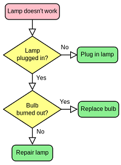

```{r setup,echo=FALSE, include=FALSE}
library(knitr)
library(dplyr)
library(tidyr)
library(ggplot2)
library(gganimate)
library(magick)

#Example functions and plots

#Discrete logistic function -----------
dlogistic <- function(K = 200, r = 1, N0 = 2, t = 15) {
  N <- c(N0, numeric(t))
  for (i in 1:t) N[i + 1] <- {
     N[i] + r * N[i] * (1 - N[i]/K)
  }
  df <- data.frame(time = 0:t, N = N)
  
  return(df)
}

#Sum of squares ---------
#Random normally-distributed variable
rand <- rnorm(20)
rand_mean <- mean(rand) # Analytical mean
rand_range <- range(rand) # range of values

#Create a sequence of "X's" in which to calculate Sum of Squares from
rand_x <- seq(from=rand_range[1],to=rand_range[2],length.out=100)

#Calculate Sum of Squares
ss <- sapply(rand_x,function(x)sum((x-rand)^2))

#Store data dataframe
ss_mean <- data.frame(SS=ss,rand_x = rand_x,time=1:100)
rand_df <- data.frame(randomX = rand, index = 1:20)


#Visualize
#Plots for animating
NewX_df <-  data.frame(NewX=rep(rand_x,each=20),
                       randomX = rep(rand,times=100),
                       index = rep(1:20,times=100),
                       frame = rep(1:20,each=100))

SSplot <- ggplot(NewX_df,aes(x=index,y=randomX))+geom_point(size=3)+
  #geom_point(rand_df,aes(x=index,y=randomX))
  geom_hline(aes(yintercept=NewX))+
  geom_segment(aes(x=index,y=randomX,xend=index,yend=NewX))+
  theme_minimal()

SSmini <- ggplot(ss_mean,aes(x=rand_x,y=ss))+geom_point()+geom_line()+
  labs(x='X',y='Sum of Squares')+geom_vline(xintercept=rand_mean,col='red')+
  geom_text(x=0.3,y=50,label='Mean = 0.23',size=5)+coord_flip()+
  ggtitle('Minimize Sum of Squares')+
  theme_classic()


#Animate side by side
SSanim <- SSplot + labs(title = 'X: {frame_time}', x = 'Index', y = 'X') +
  transition_time(frame)

SSmini_anim <- SSmini+transition_reveal(time)

#patch together
gifA  <- animate(SSanim,width=260,height=260)
gifB <- animate(SSmini_anim,width=260,height=260)

a_mgif <- image_read(gifA)
b_mgif <- image_read(gifB)

new_gif <- image_append(c(a_mgif[1], b_mgif[1]))
for(i in 2:100){
  combined <- image_append(c(a_mgif[i], b_mgif[i]))
  new_gif <- c(new_gif, combined)
}

```


```{r}
new_gif
```


## General overview
- What are functions? Computational VS Mathematical
- Writing/defining functions in R
- __for__ and __while__ loops and __if__ statements
- __apply__ family of functions
- Examples of computer, math , and a mixture of both functions
- Write your own functions: Sorting algorithms, logistic growth
- Visualize


### What are functions

The word "function" can mean different things to different people. The formal definition is actually pretty philosophical and built upon set theory, logic, with many layers of abstractions. But the most general definition is that a function takes in something (input) and spits out another (output).  

```{r pressure, echo=FALSE,fig.align='center', fig.cap="Source: Wikipedia", out.width = '25%'}
knitr::include_graphics("function_fig.png")
```

In math, we might this know as: <br>
<center> <font size="5">$f(x) = y$ </font> </center>

In this case, "X" is the input and "Y" is your output. But these Xs and Ys don't always have to be numerical values! Programmers write functions that don't deal with numbers explicitly all the time. So far, we've only made use of built-in and open-source functionss so were pretty familiar with how they generally work and take the form of  __*function(argument1, argument2)*__. Pretty simple. Writing functions in R, both computational and math ones, are that simple as well....kinda.


### Writing functions

Although R has a lot of packages and functions that are ready for people to use. In many cases, we might want to do a very specific and/or repetitive task in which we might actually want to customize our own functions. Like in any programming langugae, it's good practice to always sketch out some pseudo-code on a scratch paper before you actually code anything down. This helps to better organize your logic flow and visualize the process before delving into code that isn't always as intuitive as it may seem. 

Psuedocode can start from things as simple as flowcharts: 
```{r, echo=FALSE,fig.align='center', fig.cap="Source: Wikipedia", out.width = '25%'}

```


