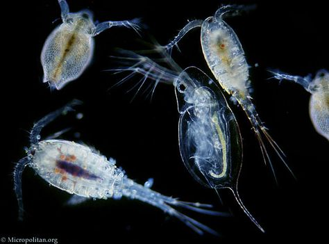

## Loading data
- There are numerous ways to load data, usually it depends on the format (.csv, .txt, .xlsx etc.) of data you are loading
- As much as possible, don't use excel because of formatting issues
- tab delimited files are the most stable


### Where can I "get" data?
- Basically from anywhere that has data stored and under the condition that you have access to it
- Example: your local machine (eg. drives, folders), web/online repository (eg. google drive, dropbox, Github)

- you can directly load data by its name if your working directory is the same as where the file is  
    - *working directory* is the default folder that your R session is working out of  

\vspace{12pt}
To check where your working directory is:   
```{r}
getwd() # get working directory (wd)
```

__*Side note*__: R studio has a functionality that allows you to create "projects" (see the *File* dropdown menu), which helps you organize the different projects that you might be using R for. Each project has its own file and the file is set as the default working directory. In this way, you can simultaneously run multiple R sessions with each working out of its own folder. 


\vspace{12pt}
To see what's inside:

```{r}
list.files()
```

\vspace{12pt}
- Different file *types* will require different functions to load. In general, the function to read in data starts with _*read*_*xxxx* (eg. read.csv(), read.table(),read.delim(), readRDS())
- In general, files are loaded by supplying the path (or link) of the file to function
- Some files (either their formats or the repository they are stored in) are not readily loadable with base R functions.  But there are a number of packages that allow you to do so
  - If you want to read excel files: __*readxl*__ (https://readxl.tidyverse.org/)
  - If you want to read, modify, or upload files from and to google drive: __*googledrive*__ (https://googledrive.tidyverse.org/index.html)


#Enough of this BORING SHIT, let's load some data!

\vspace{12pt}
```{r,echo=FALSE}
raw_data <- read.csv("https://www.dropbox.com/s/k3xvoi2vxg9p64k/zooplankton_clean.csv?dl=1")

```

```{r,eval=FALSE}
#Load directly from wd
raw_data <- read.csv('zooplankton_clean.csv') #only works for me

#Load using path
raw_data <- read.csv('/Users/jiaangou/Desktop/RStudyGroup/zooplankton_clean.csv') #only works for me

#Load from web (dropbox; need to change dl=0 to dl=1)
raw_data <- read.csv("https://www.dropbox.com/s/k3xvoi2vxg9p64k/zooplankton_clean.csv?dl=1")
#This should work for anyone with internet connection (semi-reproducible?)

```

## Get familiar with your dataset
- Some helpful functions to do so:
```{r}
class(raw_data) #class of object 
str(raw_data) #gives you an overview of your object, output depends on what the class is
summary(raw_data) #more "statistical" view than str() of your object

```


You can also directly __VIEW__ the dataframe/table within RStudio by calling:
```{r, eval=FALSE}
View(raw_data) #I purposefully did not evaluate this code to save space
```


Let's now add in another dataset:
```{r}
#Chlorophyll-a data
raw_chla <- read.csv("https://www.dropbox.com/s/7wxnvp67nawazor/chla.csv?dl=1")
```

#Dataset description
- __*raw_data*__  contains the body lengths of individual zooplanktons collected from a few alpine lakes in British Columbia, Canada in 2016. 
- The taxonomy of individual zooplankton is identified to at least the order and at most genus
- __*raw_chla*__ contains some biophysical variables of the samples collected from the lake
- In case you're wondering, zooplanktons are these adorable tiny creatures that eat algae and generally function as the primary consumers of aquatic ecosystems
           
\vspace{12pt}
```{r, echo=FALSE, out.width = '50%',fig.align='center'}

```

## Inspect the datasets a little more. Do you notice anything strange?

\newpage
# Data manipulation with *tidyverse* package

## What is tidyverse?
A collection of packages developed by Hadley Wickham and his team. The aim of this collection is to make data analysis code as "tidy" as possible. It has its own unique grammar and the names of functions are often pretty intuitive (contrast to another popular data manipulation package called data.table). 

## Why use tidyverse?
###Pros: 
- intuitive function names
- clean coding
- helpful for manipulating complex data structures
- powerful ploting functions (ggplot)
- is popular in the R community which means there are a lot of tutorials/resources online
- is open-source and always have new implementations/developments (could also be a con)

###Cons: 
- has a lot of bugs (ie. conflict between packages in tidyverse)
- has many different functions which can be intimidating at times (you need to get familiar with them to know which to use)
- New implementations mean you might need to constantly update the packcages

##The idea
Usually, the hardest part about data analysis and exploration is having the data in the right format. Tidyverse has plenty of functions that are meant to faciliate this processes. Certain analysis may require your data to be structured in a particular way. ggplot in tidyverse is also helpful for visualization of complex datasets which should help facilitate the data exploration process.

```{r,echo=F, fig.align="center", out.width = "400px"}
knitr::include_graphics("data-science-explore.png")
```

## Rules of tidy data
1. Each *variable* must have its own *column*
2. Each *observation* must have its own *row*
3. Each *value* must have its own *cell*

Following these rules, tidyverse has its own *data.frame* called a *tibble*. The two work almost exactly the same (but you might want to do some research on it yourself). When you run data frame objects through tidyverse functions, it will automatically be converted to a tibble. This means that you usually don't have to worry about it, but I'm just letting you know here in case you're wondering what tibble is when you see it. 

```{r,echo=F, fig.align="center", out.width = "400px"}
knitr::include_graphics("tidy-data.png")
```


## Part 1. Common data manipulation functions in tidyverse

*Install and loading tidyverse*
```{r,eval=FALSE}
#install.packages('tidyverse')
library(tidyverse) #loads all libraries (but you can load individuals ones too)

#Or you can load individual libraries
library(dplyr)
library(tidyr)
library(stringr)
```

```{r,echo=FALSE}
#Or you can load individual libraries
library(dplyr)
library(tidyr)
library(stringr)
```

```{r, echo=FALSE}
#Zooplankton data
raw_data <- read.csv("https://www.dropbox.com/s/k3xvoi2vxg9p64k/zooplankton_clean.csv?dl=1")
#Chlorophyll-a data
raw_chla <- read.csv("https://www.dropbox.com/s/7wxnvp67nawazor/chla.csv?dl=1")
```

- If you haven't noticed, the zooplankton data has a lot of trash
- Raw data usually have a lot of errors and unnecessary columns that we need to fix or completely throw out 

Here are some obvious ones
```{r}
#data inspection
unique(raw_data$genus) #a lot of wrong spellings
names(raw_data) #unnecessary column/variables
```

### 1a. Rename and correcting spelling error

A very handy operator in tidyverse is the piping operator *%>%*. As its name suggests, the piping operator sends the output of the previous code to the input of the next line of code. By doing so, you can elegantly group a chunk a code that does a specific task (rather than having a bunching nested functions or constantly assigning new variables) 

**Here are hypothetical examples of what I mean**

**Instead of:**
```{r,eval=F}
function1(function2(function3())) 
```
*OR*
```{r,eval=F}
x<- function1(y)
z <- function2(x)
w <- function3(z)
```

**We can do:**
```{r,eval=F}
w <- function1(y)%>%
      function2()%>%
      function3()
```


```{r}
```


*Option 1: mapvalues from plyr package*

*plyr* is another package from the tidyverse, however, for some reason it is needs to be loaded on its own (it has conflic with other libraries). The problem with plyr  is that it has some conflict with other tidyverse packages and creates errors when using its functions. So in this example, I will use :: operator too tell R to use the mapvalues functions within plyr package. This notation allows me to use specific functions in a package without loading the package fully. 

```{r}
#Option 1 using mapvalues() from plyr
clean_data <- raw_data %>% 
  select(Lake,Sample,genus,size)%>% #select necessary columns
  rename(lake = `Lake`) %>%   #rename variables names (if you want)
  rename(sample = `Sample`) %>% 
  mutate(genus=plyr::mapvalues(genus,from=c('Daphnia','daphniaa'),to=c('daphnia','daphnia')))%>% #plyr has conflict with dplyr when loaded together
  mutate(genus=plyr::mapvalues(genus,from=c('copepoda','cyclopoidae','Cyclopoida'),to=c('cyclopoida','cyclopoida','cyclopoida')))%>%
  mutate(genus=plyr::mapvalues(genus,from=c('callanoid','calanoidd'),to=c('calanoid','calanoid')))%>%
  mutate(genus=plyr::mapvalues(genus,from=c('Bosmina','bosminaa'),to=c('bosmina','bosmina')))

```

See how the clean data compares to the original one now
```{r}
#View(clean_data)
unique(clean_data$genus)
names(clean_data)
```


*Option 2 using str_replace() from stringr*

*stringr* is already loaded from loading tidyverse, so there is no need to load the package again. The str_replace works similiar to mapvalues except that arguments will not work with vectors. The problem is rather complicated, see if you can figure it out yourself, or ask me if you want to know! Instead of vectors, we need to use the | operator which essentially means "OR". In this case, str_replace will find any of the charcaters and replace it with the charcater string that you want. 

```{r}
clean_data <- raw_data%>%
  select(Lake,Sample,genus,size)%>% #select essential columns
  rename(lake = `Lake`) %>%   #rename variables names (if you want)
  rename(sample = `Sample`) %>% 
  mutate(genus = str_replace(genus, pattern = c('Daphnia|daphniaa'), replacement = c('daphnia')))%>% #replaces strings
  mutate(genus = str_replace(genus, pattern = c('copepoda|cyclopoidae|Cyclopoida'), replacement = c('cyclopoida')))%>%
  mutate(genus = str_replace(genus, pattern = c('callanoid|calanoidd'), replacement = c('calanoid')))%>%
  mutate(genus = str_replace(genus, pattern = c('Bosmina|bosminaa'), replacement = c('bosmina')))

#check again
names(clean_data)
unique(clean_data$genus)
```


- We can now do the same thing with the chlorophyll-a data
- Having variable names and values consistent across datasets is *extremely* important especially if we want to integrate them together later on (as we will do in a minute).


### Exercise 1: See if you can write your own code to clean the chla data
- Inspect the data again if you need to and take note of what you need to change
- You might want to check the clean zooplankton data to see what you might want to keep consistent


```{r,echo=FALSE}
#Chl-a 
unique(raw_chla$Lake)

clean_chla <- raw_chla%>%
  select(Lake,Depth,AvgChl)%>%
  rename(lake = `Lake`)%>%
  rename(depth = `Depth`)%>%
  mutate(lake = str_replace(lake,pattern=c('Lost Lake'),replacement=c('Lost')))%>%
  mutate(lake = str_replace(lake,pattern=c('Green Lake'),replacement=c('Green')))%>%
  mutate(lake = str_replace(lake,pattern=c('One Mile Lake'),replacement=c('One Mile')))%>%
  mutate(lake = str_replace(lake,pattern=c('Lillooet Lake'),replacement=c('Lillooet')))

#View(clean_chla)
```

\newpage
### 1b. Creating new variables based on existing variable values

A common thing to do during data analysis is to create new variables based on the values of other variables. For example, in the zooplankton dataset, we might want to convert body size to biomass based on some size-biomass equations. In this simple example, I used to size value and created a new variable called **size_category**. Can you tell from the code what I did here?

```{r}
hist(clean_data$size,breaks=50) #visualize data
mean(clean_data$size) #mean is 0.65

#create a new variable based on values of another variable
clean_data <- clean_data%>%
  mutate(size_category=ifelse(test=size>0.65,yes='large',no='small'))
```


\newpage
### Bonus exercise: Use the following taxa-specific length-weight relationships to calculate the biomass of each zooplankton individual

```{r,echo=FALSE}
LWdat<- data.frame(genus = c('bosmina','copepod','daphnia','ceriodaphnia','others'),
           equation = c('3.09 + 3.039*length','1.953 + 2.399*length','1.468 + 2.829*length','2.562 + 3.338*length','2.124 + 2.532*length'))
```

```{r,echo=FALSE}
knitr::kable(LWdat)
```


### 1c. Summary statistics

This is an __*EXTREMELY*__ helpful function that tidyverse has and I guarantee you will use it one day. Often times, we want to know how different variables affect the mean of a specific variable, but we also want to know how the means between **levels**(different factors of a signle variable; eg. the variable color contains the levels: blue, green, red) within a single variable compare. The **group_by** function splits the data set by  levels of the grouping variable and then does a summary function to each of those groups. The group_by function can contain more than 1 grouping factor. For example, if group_by(lake, sample, genus), the data will first split into lakes, then within each lake it will be split into samples, then genus and so on...

```{r}
chla_summ <- clean_chla%>%
  group_by(lake)%>%
  summarise(chla=mean(AvgChl),depth=mean(depth))

#View(chla_summ)
chla_summ
```


The above summary gives a us a rough estimate of how the different lakes compare, at least with regards to its depth and chl-a concentration. Now, we can use this as supplementary material to our zooplankton body size data. Since these are quantitative data (ie. continuous), rather than qualitative (ie. categorical/factor; such as the variable "lake"), we may use it for example, to see why some lakes might larger or small zooplankton. What I mean is, just from the lake names themselves, you have no way of telling who is more similar to who. In other words, you cannot order them in any meaningful way (except if you do it alphabetically, but that has no ecological meaning). 

Now that each lake has a single value of depth and chl-a concentration, we can combine this information with the zooplankton data set, using the shared variable "lake".

\newpage
### 1d. Data joining
```{r, echo=FALSE, out.width = '50%',fig.align='center'}
knitr::include_graphics("tidyverse-combine.png")
```

There are *A LOT* of joining functions in tidyverse (Specifically, in the dplyr package). You can make use of the dplyr cheatsheet, which is accessbile from RStudio > Help > Cheatsheets > Data manipulation with dplyr and tidyr. Just remember that the main difference between these different joining functions is that in certain instances, joining may result in loss of data and this loss is dependent on the joining function you use as well as which data frame is used as the first and which is used as the second.

```{r}
# general syntax: join_type(firstTable, secondTable, by=columnTojoinOn)

combined_data <- clean_data%>%
  left_join(chla_summ,by='lake')

str(combined_data)
```


We can come back to this later when we try and plot some data. 


### 1e. Reshaping: transposes from long-to-wide to wide-to-long

In community ecology, it is very common to treat each species as its own variable (ie. have its own column) rather than have 'species' as a variable. This means that data has to converted from long to wide. This can be easily done with the spread() function. 

Sometimes it may be easier to do calculations in the long format rather than wide. And this can be done using the gather() function. 

In this example, I first use group_by() and summarise() to get the counts (ie. abundance) of each species for each lake. I then use the spread() to split each genus into its own column with abundance as its values. I then use the gather()  function to convert it back to its orginal state.


```{r}
# i. Use summary to get counts/abundance of each species for each lake
abundance_data <- clean_data%>%
  group_by(lake,sample,genus)%>%
  summarise(abundance=n())  # the function n() simply counts the frequency of a 
#unique genus within each lake within each sample which is equivalent to its abundance

head(abundance_data)

# ii. Long --> Wide: Species vs Lake and sample  (spread)
species_matrix <- abundance_data %>% 
  spread(key = genus, value = abundance) #each genus becomes its own variable and the values associated with it are the abundances

head(species_matrix)

#Because non-occuring species are not counted there are no 0's during the 
#first summarizing step, therefore NAs are produced as a result
species_matrix[is.na(species_matrix)] <- 0  ## fills NA with 0

# iii. Wide --> Long (gather)
long_data <- species_matrix%>%
  gather(key=genus,value=abundance,-c(lake,sample)) #- sign specifies which to exclude

#check if abundances are the same
sum(as.numeric(long_data$abundance))
sum(abundance_data$abundance)
```

### Visual description of what's going on

__**SPREAD**__
```{r,echo=F, fig.align="center", out.width = "400px"}
knitr::include_graphics("spread_data_R.png")
```

__**GATHER**__
```{r,echo=F, fig.align="center", out.width = "400px"}
knitr::include_graphics("gather_data_R.png")
```


## Part 2. Visualizing data with ggplot2
```{r,echo=FALSE}
library(ggplot2)
```
__*ggplot2*__ is the plotting package of tidyverse. It looks a little complicated at first but once you get used to it you'll realize that it is quite intuitive. Personally, I like it more than base R plotting functions because it is easy to customize, makes complex data easy to visualize, and more importantly, ggplot outputs can be stored into variables (unlike base R), making it extremely convenient for specific tasks such exploratory data analysis.


### 2a. Basic syntax

When plotting with ggplot, the first thing you have to do is to let it know which __*dataframe*__ your data is coming form, which is your __*x*__ and which is __*y*__. 

Using iris dataset as an example:
```{r}
#To define the dataframe, its x's and y's, this is all you have to do.
ggplot(data=iris, aes(x=Species,y=Sepal.Length)) #aes() stands for aesthetics
```

As you can see, the previous line of code essentially sets up your graphing area with your specified x and y. But there is no points or anything plotted to it yet! To do so, you simply add (literally with "+" sign) additional functions to it. 

```{r,eval=FALSE}
ggplot(iris,aes(x=Species,y=Sepal.Length))+geom_point()+geom_boxplot() #order matters

ggplot(iris,aes(x=Species,y=Sepal.Length))+geom_boxplot()+geom_point()#plots boxes first then points
```

```{r,echo=FALSE, out.width='50%'}
ggplot(iris,aes(x=Species,y=Sepal.Length))+geom_point()+geom_boxplot() #order matters

ggplot(iris,aes(x=Species,y=Sepal.Length))+geom_boxplot()+geom_point()#plots boxes first then points

```

You might have noticed that this grammar is very similar to the %>% operator we've seen previously. The idea is exactly the same. What you have set as your dataframe, and the x and y, gets passed down to the functions that you add to the initial ggplot(). That's why you do not need any additional arguments within in geom_point() and geom_boxplot().


As I have mentioned previously, ggplot objects can be stored in a variable. You can then "add" additional things to to it as you would normally do with any ggplot functions. Below is an example where I assign the ggplot object into a variable called "iris.p". I then add geom_jitter() to the iris.p and a plot containing iris.p with points jittered along the x-axis. Jittering is a way of spreading out points that are clustered together. This make easier to see how many points are actually there and they vary along the y-axis. 

```{r}
iris.p <- ggplot(iris,aes(x=Species,y=Sepal.Length))+geom_boxplot()
iris.p + geom_jitter()
```


### 2b. Customizing ggplot layout

ggplot has a lot of built-in layouts, or "themes", ready to use on the spot. Here are some examples.

```{r,eval=FALSE}
iris.p + theme_bw()
iris.p + theme_classic()
iris.p + theme_light()
```

```{r,echo=FALSE,out.width='30%'}
iris.p + theme_dark()
iris.p + theme_classic()
iris.p + theme_minimal()
```

These built-in themes will usually suffice but sometimes you might want to adjust the font sizes, especially for presentations. You can easily do so using the theme() function.

```{r}
iris.p + theme(axis.text.x=element_text(size=13), 
              axis.text.y=element_text(size=13),
              panel.background=element_blank())
```

You can probably tell which argument is for what feature of the plot. That's what I mean when I say ggplot (and tidyverse in general) is quite intuitive. You just have to familiarize yourself with them!

### 2c. Animations

You can even make animated figures pretty easily
```{r,eval=FALSE}
#generate fake data
fake_data <- data.frame(y=rep(runif(45)),group=rep(c('a','b','c'),each=15),time=rep(seq(15),3))

#visualize
fake_p <-ggplot(fake_data,aes(x=time,y=y,group=group,col=group))+geom_point()+geom_line()

#animate
library(gganimate)
fake_p + transition_reveal(time)
```


### Revisiting the zooplankton data set

The dataset is quite simple, but there are A MILLION ways in which you can visualize the data. As you probably already know, what you deem as the "best" plot, will depend on what aspects of the data are you trying to show! Here are some examples of graphs you can do with the dataset.


```{r,out.width='60%'}
ggplot(combined_data,aes(x=lake,y=size,fill=genus,col=genus))+geom_boxplot()+geom_jitter()+facet_wrap(~genus)+theme_classic()
```

```{r,out.width='60%'}
ggplot(combined_data,aes(x=depth,y=size,col=genus,shape=lake))+
  geom_jitter(size=scales::rescale(combined_data$chla,to=c(0,1)))+theme_classic()

```

### Exercise 3: Make a figure that visualizes the relationship between lake chlorophyll-a content and zooplankton body size


## Take-home messages

1. Tidyverse functions are especially helpful when dealing with complex data structures (both in terms of manipulating and visualizing)

2. There are a lot of help files/cheatsheets, so don't worry about memorizing all these different functions

3. Always think about what you are trying to __*show*__ with your data so that you know how to arrange it and how to visualize it in a way that is easy to understand for both you and your audience. 

4. Think TIDY TIDY TIDY TIDY!! 


