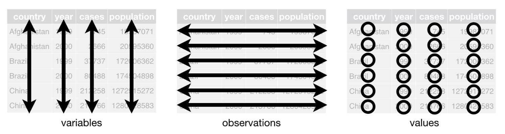

```{r, include=FALSE}
#Load libraries
library(dplyr)
library(tidyr)
library(stringr)

#Load previous data
clean_data <- read.csv('clean_data.csv')
chla_summ <- read.csv('chla_summ.csv')
```

## Contents

1. Review: i) *tidy* philosophy, ii) indexing
2. Reshaping (pivotting)
3. Data manipulation assignment
4. Visualizing (if time permitting)

## 1. Review:
### i) *tidy* philosophy

### Rules of tidy data
- Each *variable* must have its own *column*
- Each *observation* must have its own *row*
- Each *value* must have its own *cell*

```{r,echo=F, fig.align="center", out.width = "400px"}

```

### The program:
- Transform data to help highlight/visualize the relationships between different variables
- The more complex the data the more ways you can transform it
- ITERATE! 

```{r,echo=F, fig.align="center", out.width = "400px"}
knitr::include_graphics("data-science-explore.png")
```

### Tidy code:
- The piping operator __*%>%*__ can help you organize your script such that every line corresponds to just 1 specific action

### ii) Indexing

- __INTEGERS__ - indexing can be done by supplying a vector of __*integers*__ which correspond to the observations in your vector/dataframe/matrix/etc...

```{r}
random_vector <- c(4,19,2,28,115,1832,18)

random_vector[4] #returns the 4th element of the vector

random_vector[c(3,5,1)] #returns the elements 3,5,1 (and in that sequence) 
```

- __BOOLEAN__ - more commonly, indexing is done by specifying some __*conditional statement*__ which in essense returns a vector of type __*boolean*__ that is used to subset/index your data
```{r}
random_vector>3 #this gives a vector of TRUE/FALSE in which the TRUE/FALSE correspond to 
# the sequence of values in the original vector that satisfies the condition >3

random_vector[random_vector>3] #returns those values that are >3

```

- Indexing/subsetting by boolean is straightforward when you consider __*just 1 conditional statement*__ and more so when that conditional statement returns a vector of TRUE/FALSE of the __*same length*__ as the vector you indexing

```{r}
length(random_vector)==length(random_vector>3)
```

- Sometimes your code runs but there's actually a bug that you can't see right away

```{r}
random_vector[c(TRUE,FALSE,FALSE)] 
```

- the boolean vector only has length 3 but it still manages to subset more than 3 values, what happens is that R will recycle those TRUE/FALSE until iterating through the whole length of the sequence 

In other words, supplying c(TRUE,FALSE) will give you every other value
```{r}
random_vector[c(TRUE,FALSE)] 
```


- The problem of the example below is more obvious because T/F is longer than the actual vector, leading to production of NAs

```{r}
random_vector[c(TRUE,FALSE,FALSE,TRUE,TRUE,FALSE,FALSE,TRUE,TRUE,TRUE,TRUE)] 
```


- When working with dataframes (ie. multiple vectors (columns) that are related to one another (row, observation)), we might want to subset by multiple conditional statements 


- __*logical*__ operators (ie. if, or, &, etc..) are used to combine and relate boolean vectors:

```{r, echo=FALSE, out.width = '50%',fig.align='center'}
knitr::include_graphics("transform-logical.png")
```

__An example with with mtcars data:__

```{r}
head(mtcars)

#select cars with 6 cylinders (condition 1) AND hp less than 110 (condition 2)
mtcars$cyl == 6 #Condition 1
mtcars$hp < 110 #Condition 2
#Index/subset by using & operator
mtcars[mtcars$cyl==6 & mtcars$hp<110,]


#tidyverse solution
mtcars%>%
  filter(cyl==6 & hp<110) #Note: rownames are removed when using tidyverse functions
```


## 2. Reshaping: transposing/pivoting

- From the *tidy philosophy* section, we talked about the iterative process of data exploration (transform --> visualize --> transform...)
- From the *tidy data* section we see that each row should always represent an observation of __n__-variables
- Data transformations therefore provide a way to alter *relationship* between variables

- In tidyverse, reshaping data is done by pivoting (w/ pivot_wider() or pivot_longer())
- NOTE: originally the functions were spread() and gather(), but the idea is the same

__**Pivot wider (spread)**__
```{r,echo=F, fig.align="center", out.width = "400px"}
knitr::include_graphics("spread_data_R.png")
```

__**Pivot longer (gather)**__
```{r,echo=F, fig.align="center", out.width = "400px"}
knitr::include_graphics("gather_data_R.png")
```


For example, in the zooplankton dataset, I might be interested in the correlation between the abundance of different species. In this case, each row (ie. observation) should represent a unique sampling event in which each species is its own variable with values = to their observed abundances.

To do so: 
1. I use group_by() and summarise() to get the counts (ie. abundance) of each species for each lake. 

```{r}
# i. Use summary to get counts/abundance of each species for each lake
abundance_data <- clean_data%>%
  group_by(lake,sample,genus)%>%
  summarise(abundance=n())  # the function n() simply counts the frequency of a 
#unique genus within each lake within each sample which is equivalent to its abundance

head(abundance_data)

```

2. I then use to pivot_wider() function to "spread" the *genus* column into its own individual columns with the *abundance* as its values. 

```{r}
species_matrix <- abundance_data%>%
  pivot_wider(names_from = 'genus',values_from = 'abundance')%>%
  replace(is.na(.),0)
#Since the rows in the original data represent only presences (ie. absences do not 
# have observations), NAs are produced when transformed to the wide form. The arugment
# values_fill provides a way to fill those NAs
```

- The difference between the original (abundance_data) and new (species_matrix) is that the original focuses on individual zooplanktons (each observation represents an individual) while the new one focuses on the sample (or the community of zooplanktons)

```{r}
nrow(clean_data) #individual zooplankton
nrow(abundance_data) #population-level (genus)
nrow(species_matrix) #community-level (sample)
```

- I can now easily get the correlation matrix of species abundances
```{r}
species_matrix%>%ungroup%>%select(-lake,-sample)%>%cor
```

\newpage
## 3) Data manipulation assignment: NYC flights

```{r}
library(nycflights13)
```

```{r,echo=FALSE}
flights <- flights
```

- Inspect the data
```{r}
head(flights)
str(flights)

```

```{r}
# There are 3 airports in NYC
flights$origin%>%
  unique() 

#And a total of 105 destinations
flights$dest%>%
  unique()%>%
  length() 
```

__Question 1__ 
a) Which NYC airport has the most flights? 

- Because each observation (ie. each row) represents a single flight, we simply tally the number of observation by each airport (using group_by() and summarise())

```{r}
flights%>%
  group_by(origin)%>%
  summarise(count=n())
```

- Answer for a) is: EWR > JFK > LGA


b) Which NYC airport flies to the most destinations? 

- This is similar to a) but we now want to remove the duplicated destinations within each NYC airport (within each group) and we can do that easily by using the function distinct()

```{r}
total_flights <- flights%>%
  group_by(origin)%>%
  distinct(dest)%>%
  summarise(count=n())
total_flights
```

- Answer to B: EWR > JFK > LGA

__*Any alternative solutions??*__


c) BONUS: What are the top 3 destinations of each airport

- Option 1: split each airport up and get the two individually
- Option 2: Use pivot to keep the data together


```{r}
#group_by summary to get the total flights to each dest by airport, then pivot
pivot_flight <- flights%>%
  group_by(origin,dest)%>%
  summarise(count=n())%>%
  pivot_wider(names_from='origin',values_from='count') #pivot
head(pivot_flight)
```  

- Then use the arrange() function to order each column in descending order

```{r}
#Arrange 
pivot_flight%>%
  arrange(desc(EWR))
  
pivot_flight%>%
  arrange(desc(JFK))

pivot_flight%>%
  arrange(desc(LGA))

```

__Question 2__
For simplicity, let's assume that delay means that there are delays in arrival and departure (ie. arrival>0 depart>0).

```{r}
#filter observations with delays in both arrival and departure
delay_flights <- flights%>%
  filter(arr_delay>0&dep_delay>0) 
```

a) Which airport has the "MOST" (ie. frequency) delays? 
```{r}
airport_delays <- delay_flights%>%
  group_by(origin)%>%
  summarise(delays=n())
```

b) Does the ranking of a) change after dividing by the number of flight for each airport (1a)?

- This is where __*join*__ functions become useful

```{r}
delay_ratio <- airport_delays %>%
  left_join(total_flights,by='origin')%>%
  mutate(ratio = delays/count)

data.frame(origin=delay_ratio$origin,DelayRatio=delay_ratio$ratio)
```

c) On average, which carrier has the "LONGEST" (ie. duration) delays? (Add arrival and departure delays together)

- Use mutate to combine variables

```{r}
delay_flights%>%
  mutate(total_delay = arr_delay + dep_delay)%>%
  group_by(carrier)%>%
  summarise(mean_delay=mean(total_delay))%>%
  arrange(desc(mean_delay))

```


__Question 3__ Using the overall mean, convert travel distances into 2 distance categories (ie.longer or shorter than average). Do departure or arrival delay times differ betweeen distance categories?

- use ifelse() within the mutate function to assign distance categories based on the mean
- Then, calculate another set of averages (and SD if you want) of each category. Do this calculation for arrival delay and departure delay separtely

```{r}
delay_flights%>%
  mutate(dist_class = ifelse(distance>mean(distance),'long','short'))%>%
  group_by(dist_class)%>%
  summarise(arrival_delay = mean(arr_delay),departure_delay = mean(dep_delay), 
            arrival_sd = sd(arr_delay), departure_sd = sd(dep_delay))
```


\newpage

## 4) Visualizing data with ggplot2
```{r,echo=FALSE}
library(ggplot2)
```
__*ggplot2*__ is the plotting package of tidyverse. It looks a little complicated at first but once you get used to it you'll realize that it is quite intuitive. Personally, I like it more than base R plotting functions because it is easy to customize, makes complex data easy to visualize, and more importantly, ggplot outputs can be stored into variables (unlike base R), making it extremely convenient for specific tasks such exploratory data analysis.


### 2a. Basic syntax

When plotting with ggplot, the first thing you have to do is to let it know which __*dataframe*__ your data is coming form, which is your __*x*__ and which is __*y*__. 

Using iris dataset as an example:
```{r}
#To define the dataframe, its x's and y's, this is all you have to do.
ggplot(data=iris, aes(x=Species,y=Sepal.Length)) #aes() stands for aesthetics
```

As you can see, the previous line of code essentially sets up your graphing area with your specified x and y. But there is no points or anything plotted to it yet! To do so, you simply add (literally with "+" sign) additional functions to it. 

```{r,eval=FALSE}
ggplot(iris,aes(x=Species,y=Sepal.Length))+geom_point()+geom_boxplot() #order matters

ggplot(iris,aes(x=Species,y=Sepal.Length))+geom_boxplot()+geom_point()#plots boxes first then points
```

```{r,echo=FALSE, out.width='50%'}
ggplot(iris,aes(x=Species,y=Sepal.Length))+geom_point()+geom_boxplot() #order matters

ggplot(iris,aes(x=Species,y=Sepal.Length))+geom_boxplot()+geom_point()#plots boxes first then points

```

You might have noticed that this grammar is very similar to the %>% operator we've seen previously. The idea is exactly the same. What you have set as your dataframe, and the x and y, gets passed down to the functions that you add to the initial ggplot(). That's why you do not need any additional arguments within in geom_point() and geom_boxplot().


As I have mentioned previously, ggplot objects can be stored in a variable. You can then "add" additional things to to it as you would normally do with any ggplot functions. Below is an example where I assign the ggplot object into a variable called "iris.p". I then add geom_jitter() to the iris.p and a plot containing iris.p with points jittered along the x-axis. Jittering is a way of spreading out points that are clustered together. This make easier to see how many points are actually there and they vary along the y-axis. 

```{r}
iris.p <- ggplot(iris,aes(x=Species,y=Sepal.Length))+geom_boxplot()
iris.p + geom_jitter()
```


### 2b. Customizing ggplot layout

ggplot has a lot of built-in layouts, or "themes", ready to use on the spot. Here are some examples.

```{r,eval=FALSE}
iris.p + theme_bw()
iris.p + theme_classic()
iris.p + theme_light()
```

```{r,echo=FALSE,out.width='30%'}
iris.p + theme_dark()
iris.p + theme_classic()
iris.p + theme_minimal()
```

These built-in themes will usually suffice but sometimes you might want to adjust the font sizes, especially for presentations. You can easily do so using the theme() function.

```{r}
iris.p + theme(axis.text.x=element_text(size=13), 
              axis.text.y=element_text(size=13),
              panel.background=element_blank())
```

You can probably tell which argument is for what feature of the plot. That's what I mean when I say ggplot (and tidyverse in general) is quite intuitive. You just have to familiarize yourself with them!

### 2c. Animations

You can even make animated figures pretty easily
```{r,eval=FALSE}
#generate fake data
fake_data <- data.frame(y=rep(runif(45)),group=rep(c('a','b','c'),each=15),time=rep(seq(15),3))

#visualize
fake_p <-ggplot(fake_data,aes(x=time,y=y,group=group,col=group))+geom_point()+geom_line()

#animate
library(gganimate)
fake_p + transition_reveal(time)
```


```{r, echo=FALSE,eval=FALSE}
### Revisiting the zooplankton data set

#The dataset is quite simple, but there are A MILLION ways in which you can visualize the #data. As you probably already know, what you deem as the "best" plot, will depend on what #aspects of the data are you trying to show! Here are some examples of graphs you can do #with the dataset.


#{r,out.width='60%'}
ggplot(combined_data,aes(x=lake,y=size,fill=genus,col=genus))+geom_boxplot()+geom_jitter()+ffacet_wrap(~genus)+theme_classic()


#{r,out.width='60%'}
ggplot(combined_data,aes(x=depth,y=size,col=genus,shape=lake))+
  geom_jitter(size=scales::rescale(combined_data$chla,to=c(0,1)))+theme_classic()

```


## Exercise: Make a figure with the nycflights dataset. You can plot the raw data or some some summary statistics of your choice.

```{r,echo=FALSE,fig.align= "center",message=FALSE}
#Bipartite flight network
bipartite_flights<- flights%>%
  group_by(origin,dest)%>%
  summarise(weight=n())%>%
  as.data.frame()
library(igraph)

flight_graph <- graph_from_data_frame(bipartite_flights,directed=FALSE)
V(flight_graph)$type <- V(flight_graph)$name %in% bipartite_flights[,1]
#weight by largest 
E(flight_graph)$weight <- E(flight_graph)$weight/max(E(flight_graph)$weight)

V(flight_graph)$color <- V(flight_graph)$type
V(flight_graph)$color=gsub("FALSE","#F4EDCA",V(flight_graph)$color)
V(flight_graph)$color=gsub("TRUE","#C3D7A4",V(flight_graph)$color)


plot(flight_graph, edge.color="gray30",vertex.label.color= "black",
     vertex.size=8,vertex.label= NA,
     layout=layout_as_bipartite(flight_graph),edge.width=E(flight_graph)$weight)

```

