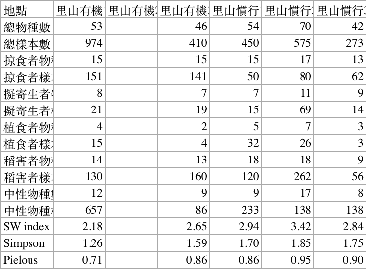

## Why use R?
1. Clean and fast way of doing repetitive things 
2. Reproducible (anyone with your script can do exactly what you did)
3. Easy calculations
4. Data wrangling: cleaning and organizing data
5. Data visualization 
6. Tons of libraries for you to use  - libraries are essentially functions that people have written already that you can use
7. A friendly community where everyone helps everyone!

Any thing else?


##What is R Studio?

- an open-source Integrated Development Environment (IDE) for R
- helps you keep track of things 
<div style="margin-bottom:10px;">
</div>
1. Code Editor - Basically your note pad or sketch pad for code
2. R Console - This is what R itself actually is -- where your executed code goes to and where the output of those executed code shows, too
3. Workspace & History- Keeps track of all the variables you have assigned, data you have loaded, and code that you executed
4. Plots and files - The graphical device of your plots and shows where your files are (not too useful IMO)

####R Studio interface
```{r,echo=F, fig.align="center", out.width = "400px"}
#knitr::include_graphics("/Users/jiaangou/Desktop/rstudio-interface.png")
```


##R syntax and defintions
- "<-" is used to assign a value or object to a variable 
```{r, error=T}
a <- 3 # The value 3 is assigned to the variable a
a

a + 1

A #R is case sensitive! 
```


## 1. Operators

#### 1a. Arithmetic: +, -, /, *

```{r}
1+1
1-5
1+5/2 #Order of operations still holds!
2*4-2
```
<div style="margin-bottom:50px;">
</div>

#### 1b. Logical or Boolean: >,<,<=,>=,==, !=
```{r}
1>3 #greater than
1>=0.1 #greater than or equal to
1<=4 #less than or equal to
112==2 #equal to
15!=2 #not equal to
```


### 2. Class (or the "type" of object)
- This is usually the cause of all problems! 
- Most functions can only accept a certain "class" of object as input. When it is not, you will get an error message
- Whenever you get an error message, check if your objects are the right class!

#### 2a. Numeric  - outputs of arithmetic expressions are numeric
```{r}
class(5+1)
```

#### 2b. Logical - output of logical/boolean expressions
- These are essentially binary outputs (ie. TRUE = 1 and FALSE = 0)
- In R, you can apply arithmetic operators to  TRUE and FALSE 
```{r}
class(5>2)
(5>2)+(1==1)
class((5>2)+(1==1)) #
```
- this one is an integer, which generally works the same as numeric. The main difference has something to do with how the memory is stored in the machine...  TLDR not important but watch out 


#### 2c. Character or "string"
- non-numerical "values" like words (but numerical values can be stored as charcaters too!)
- these values are specified with quotation marks "" or '' 
- letters or words without "" marks are read by R as variables
- __*NOTE: characters are sometimes automatically converted to another class known as "factors", like categorical variables in an ANOVA *__
```{r,error=T}
sentence <- "Hello, mortals."
print(sentence)
class(sentence)
print('sentence') #by adding '', the letters in senetence is a charcater object 
#and not the variable that I have previously assigned
class('5193') 
class(5193)
'5123'+3 #common mistake/error !!
```

#### 2d. Factors
- factors are almost identical to characters, in fact, they are interchangeable sometimes
- are more commonly used in terms of data analysis 
- differ from characters in that they have "levels", or unique entries in the vector of factor elements
```{r}
char <- c('a','a','a','b','d','d','d') #a character vector
char
factor(char)
```

- By default, factor levels will be sorted alphabetically (or numerically if the factors are numbers)
- This can be changed by including an additional argument in the __*factor()*__ function:

```{r}
new_fact <- factor(char)
factor(new_fact,levels=c('d','a','b'))

```


#### Converting between classes
- you can use built-in function in R to convert between classes
- it usually looks something like as.*class to convert to* ()

```{r}
v <- c(1,2,4,2)
as.factor(v) #to factor
as.character(v)
as.integer(v)
```


## Data structures

```{r,echo=F, fig.align='center', out.width="300px"}
knitr::include_graphics('RDataStructures.png')
```


#### 1. Vectors 
- A series of n-elements in which all elements are of the same class
- Key here is that everything is of the same class! 
- Becuase all elements are of the same class, the class() function returns the class of the objects and not a "vector" class (ie. there is no "vector" class)
- to create a vector, you can use c()

Indexing: 
__*vec[i]*__ (ie. the *ith* element of vector *vec*)
```{r}
c(1,2,5,2) # vector of integers/numerical values
class(c(1,2,5,2))

class(c(2,2,4,'bb')) #numerical values are forced as characters

length(c(1,2,4,5,14)) #length() is a function that tells you the number of elements of your object
```


#### BONUS!! A cool thing about vectors: It makes things faster!
- You might hear people say that a solution or algorithm is "vectorized", and this is what they are talking about. 

Say we have a numeric vector, *vec*:
```{r}
vec <- c(1,2,4,2,5)
vec
```
Imagine we want to add 1 to all of the elements of *vec*. One way to do it is to iterate through each of the vector elements and add 1 to each iteration, like so:
```{r}
# for loop
system.time(for (i in 1:length(vec)){
  vec[i] <- vec[i]+1
  })

vec
```
__OR__ Option 2, we could just simply +1 to the whole vector
```{r}
system.time(vec <- vec+1)
vec
```

Option 2 is so fast that the decimals were not enough to show the time! Although Option 1 was pretty fast too (0.002s), these kind of computations will become extremely long to compute when you have a LARGE data set (eg. 10000+). Moreover, Option 2 is also just a more elegant piece of code!


#### 2. Data frames
- This is probably what you will work with the most, so get familiar with it!
- The best way to describe a data frame is that it is a list of vectors, in which each column is a vector and the rows are the elements of the vector
- Following this description, elements within a column of a dataframe should always be of the same class while elements between columns do not necessarily have to!
- This brings up another important point: Data should __ALWAYS__ be organized in the long format! Ie. Each column should represent a single variable and rows should be represent 1 some sample of that/those variable/s

Indexing:
- Data frames are indexed by the notation *df[row,column]* (eg. row 1 column 3 of df is df[1,3])
- $ notation can be also used to index the columns of data frames

```{r}
df <- data.frame(x=c(2,4,1,5,9),y=c('b','b','b','a','a'))
df

df$x #outputs the vector x of data frame df

class(df$x)
class(df$y)

df[2,] #outputs row 2 of every column; empty column means all columns are selected

df[,1] #same as df$x but using indices instead of the variable name
```

\newpage
__What's wrong with this?__ 

```{r,echo=F, fig.align="center", out.width = "300px"}
#
```

```{r, include=FALSE}
area = round(rnorm(5,300,60),2)
popsize = rpois(5,1000)
gdp = rnorm(5,40)
baddata <- as.data.frame(matrix(c(area,popsize,gdp),byrow = T,ncol=5))

baddata <- cbind('site'=c('population size (10^6)','area (km^2)','GDP (10^3)'),baddata)

names(baddata)[2:6] <- c('Glasgow','Guanacaste','Cape Town','Okinawa','Pasoh')
```

```{r}
baddata
```


#### 3. Matrices
- Are essentially multidimensional vectors 
- Just like vectors, they can only contain values of one  __*class*__ at a time

- m x n * n x p = m x p matrix

```{r}
set.seed(12)
mn <- matrix(rnorm(n=12,mean=4),nrow=4) #4*3 matrix
np <- matrix(rnorm(n=9,mean=10,sd=3),nrow=3) #3*3 matrix
```
```{r}
mn
np
mn%*%np #matrix multiplication
```


#### 4. Lists
- Lists are useful for storing __*groups*__ of similar objects together
- These objects *CAN* be of different classes *(LIKE VERY DIFFERENT)*
- Can become very useful when you want to apply different functions to different sections of your data

```{r}
vec <- c('how','now','brown','cow')
protime <- system.time(1+1)
mat <- matrix(rnorm(10),nrow=5)
df <- data.frame(color=c('red','blue','gree'),integers=c(2,5,1))

demolist <- list(vec,protime,mat,df)
demolist
```
\newpage
##Exercises

### Excercise 1: Create a new vector from an existing one that has its elements shifted to the right (1st becomes 2nd and last becomes the first)

- if the original vector is c(5,3,1,2), return the vector c(2,5,3,1)
- There are multiple ways to do it but the BEST answer is one that is generalized and works for any vector 
- HINT: try using length() and seq(); use ?seq (or ?length) to see what it does 


### Excercise 2: Use logical operators to check how many values in this numeric vector is __*below*__ the value 10

```{r}
set.seed(123)
num_vec <- rnorm(5000,30,10)
```

- the answer should be 117

```{r,include=FALSE}
sum(num_vec<10)
```

### Excercise 3: Multiply the values of vec that are >9 and <12 by 1000

```{r,include=FALSE}
answer <- num_vec[num_vec>9&num_vec<12]*1000
```

```{r}
answer
```


\newpage
### Loading data
- There are numerous ways to load data, usually it depends on the format (.csv, .txt, .xlsx etc.) of data you are loading
- As much as possible, don't use excel because of formatting issues
- tab delimited files are the most stable
- you can directly load data by its name if you are working directory is in the same as where the file is
- or you can load it by providing the path of the file
```{r,eval=FALSE}
dat <- read.csv('zooplankton_clean.csv')

dat <- read.csv('/Users/jiaangou/Desktop/RStudyGroup/zooplankton_clean.csv')

dat <- read.csv("https://www.dropbox.com/s/k3xvoi2vxg9p64k/zooplankton_clean.csv?dl=1")
```


### Data manipulation with *tidyverse* package
- *tidyverse* is a series of packages which was created to make data science as "tidy" as possible
- Useful for quick and clean manipulation and visualization (ggplot) of complex data
- It has its own unique syntax, which is often more intuitive than base R (IMO)
- __*Problem*__: Too many different packages and too many different functions that sometimes do the similar things. Also a lot of error
- Thankfully, there are a lot of cheatsheets and people are helpful

###Install and loading library

```{r, eval=FALSE}
install.packages('tidyverse')
library(tidyverse)
```


### Practice data set: Zooplankton body sizes across 4 different lakes in BC

Load directly from dropbox: 
```{r, eval=FALSE}
zooplankton <- read.csv("https://www.dropbox.com/s/500av3zullmiti7/zooplankton.csv?dl=1")
```

- Inspect the data set first. Some helpful functions to help you do so: View(), head(), str()
- Make some easy plots: hist(), boxplot(y~x)
- If you inspect the genus variable more closely you might find some errors
